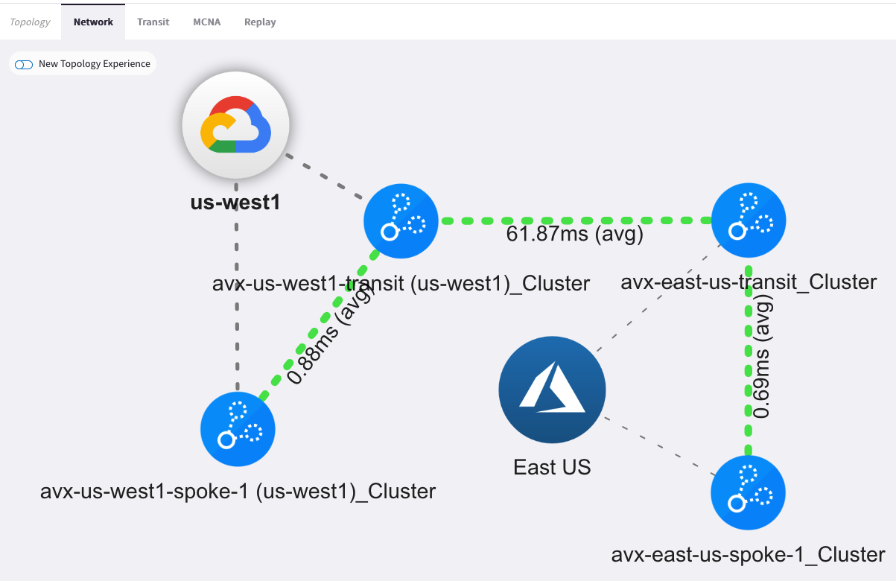

# avx-vs-csp-terraform

Comparison of Aviatrix orchestrated terraform versus building from scratch with each csp directly

## Overview

The purpose of this repository is to demonstrate the relative simplicity of orchestrating multicloud networks and connectivity with the Aviatrix terraform provider compared to the same with the CSP provider(s) directly. There are two distinct sets of terraform code that builds an identical set of infrastructure.

## Repository Layout

- `/avx`: stand-alone terraform code that leverages Aviatrix terraform modules to build cloud networks and orchestrate multicloud connectivity.
- `/csp`: stand-alone terraform code that leverages CSP terraform providers to build cloud networks and the Aviatrix terraform provider for establishing multicloud connectivity.
- `/images`: in-line images for the readme

## Infrastructure Deployed

- Transit VPC/Vnet in Azure and GCP
- Spoke VPC/Vnet in Azure and GCP
- Connectivity between Azure spoke and GCP spoke achieved via:
  - AVX Transit Gateway(s) deployed in Azure and GCP transit VPC/Vnet(s) and connected via Aviatrix transit peering
  - AVX Spoke Gateways(s) deployed in Azure and GCP spoke VPC/Vnet(s) and attached to their respective Aviatrix Transit Gateways
- Palo Alto Firewall deployed to Azure Transit Vnet (via Aviatrix) and inserted into the data path via Aviatrix Firenet

## Infrastructure Diagram

Infrastructure built by both sets of code.

## Notes

Recognize that both sets of code leverage the Aviatrix platform to provide multicloud connectivity. The Aviatrix software defined networking platform simplifies network configuration by defining routing _intent_, while the platform itself orchestrates the underlying network _routes_. Comparing the level of (significant) effort in creating connectivity within and between cloud providers is outside the scope of this code.
